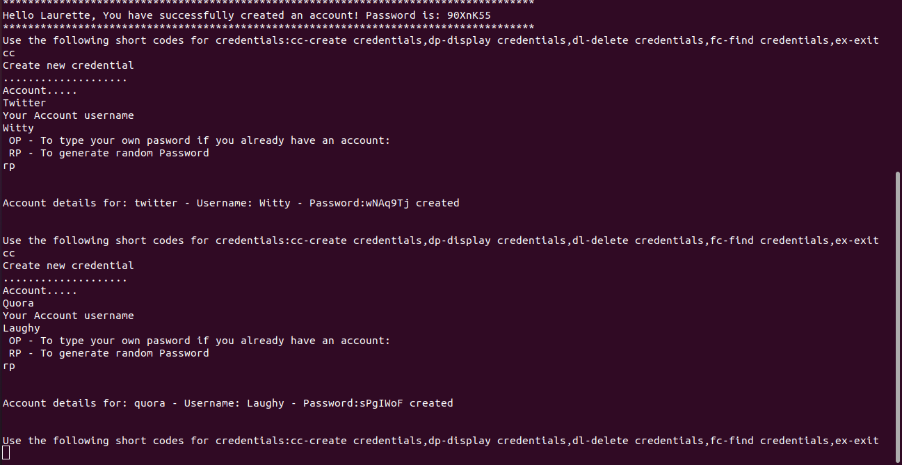

# Password_locker
# Build by Laurette
## DESCRIPTION
Password_Locker is a terminal run python application that allows users to store details i.e. usernames and passwords of their various accounts. It also generates passwords for user.
## User Stories
These are the behaviours/features that the application implements for use by a user.

<ul>
<li>As a user, I want to create a password locker account with my details, a login username and password.</li>
<li>As a user, I want to store my already existing account credentials in the application.</li>
<li>As a user, I want to create new account credentials in the application.</li>
<li>As a user, I want to have the option of putting in a password that I want to use for the new credential account.</li>
<li>As a user, I also want to view my various account credentials and their passwords in the application.</li>
<li>As a user, I want to delete a credentials account that I no longer need in the application.</li>

## BDD
Behaviour driven development

| Behaviour          | Input | Output |
| -------------  | ----------| -----------  |
| Open the application on the timeline|Run the command ./run.py   | Heyy,welcome to password locker. What is your name?     |
| Select ca | Input username and password | Hello username, you have successfully created an account. password: |
| Select lo | Input your password and username | Short codes to help user navigate application |
|  Create and store a new credential| cc | Input account name,username and password(choose op(own)or rp to generate) |
|Display all stored credentials|dp|A list of all credentials that has been stored or You don't have any credentials saved yet|
|Delete an existing credential|dl|Input the username for the credential you want to delete and returns a message|
|Exit|ex|The application is exited

## Setup Installation

### Requirements
<ul>
<li>Python 3.8</li>
<li>Pyperclip</li>
<li>Pip</li>
</ul>

### Cloning

<ul>
<li>Open the terminal</li>
<li>git clone https://github.com/LauretteMongina/password_lock.git</li>
</ul>

### Running Application
Open cloned folder in terminal
  Run these commands:
   $ chmod +xrun.py
   $ ./run.py

### Testing 
  Run $python3 users_test.py

## Technologies Used
<ol>
<li>python3.8</li>

## Known Bugs
<ol>
<li>There are no known bugs in the application</li>

## Contact Information
If you have any questions, reach out to me via monginalaurette@gmail.com

## License
MIT license

Copyright(c)2021 Laurette Mong'ina.

